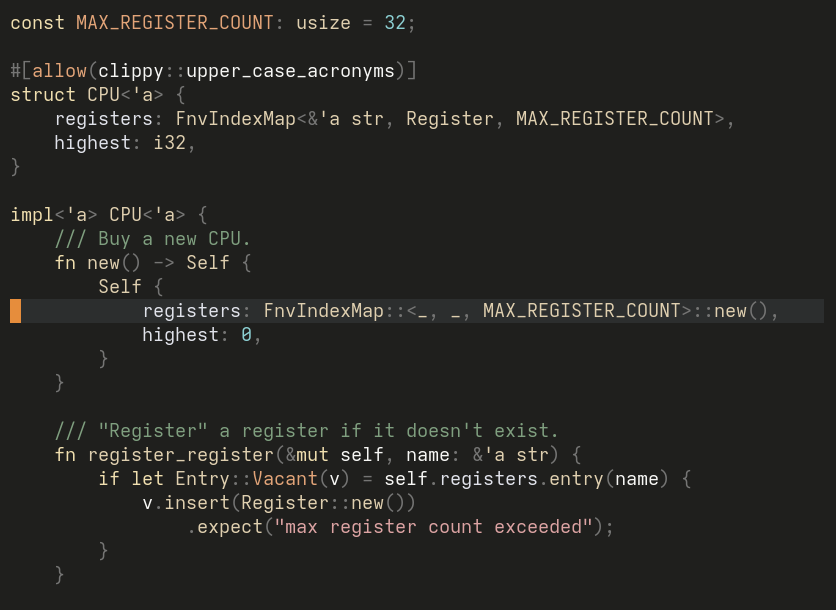

Zenburn
=======

A port of the venerable [Zenburn](https://github.com/jnurmine/Zenburn)
colorscheme to lua.  Well, it's actually a _port_ of
[Zenburn.nvim](https://github.com/phha/zenburn.nvim), with a few personal
tweaks.  All credit to jnurmine for creating the original Zenburn, my all-time
favorite colorscheme.  And to phha for porting it to lua.  I just tweaked some
colors.

Zenburn is a low-contrast color scheme for Vim. It’s easy for your eyes and
designed to keep you in the zone for long programming sessions.

The aim of this port is to bring Zenburn into the modern age, with support for
[Treesitter](https://github.com/nvim-treesitter/nvim-treesitter) and many
more plugins.



Installation
------------

Using your favorite package manager:

[vim-plug](https://github.com/junegunn/vim-plug)

```vim
Plug "mwcz/zenburn.nvim"
```

[packer](https://github.com/wbthomason/packer.nvim)

```lua
use {
    "mwcz/zenburn.nvim",
    config = function() require("zenburn").setup() end
}
```

[paq](https://github.com/savq/paq-nvim)

```lua
require("paq") {
    "mwcz/zenburn.nvim";
}
```

Setup
-----

With VimScript:

```vim
colorscheme zenburn
```

With lua:

```lua
require("zenburn").setup()
```

To set the theme in lualine:

```lua
require("lualine").setup {
    options = {
        theme = "zenburn",
    }
}
```

Status
------

Zenburn is in *Alpha* status, being based on Zenburm.nvim which is itself in
alpha. I created this by copying the colors from Iceberg's `iceberg.vim` file
into the Zenburn.nvim repo.  Probably a bad move, but I felt more comfortable
with the lua-based layout of Zenburn.nvim, and wanted to use it to make tweaks
to Iceberg.

Contributing
------------

Pull requests are always welcome, especially for additional plugins and for
cleaning up the excessive highlight groups that I copied in from `iceberg.vim`.
Please include one or more screenshots showcasing your contribution.
